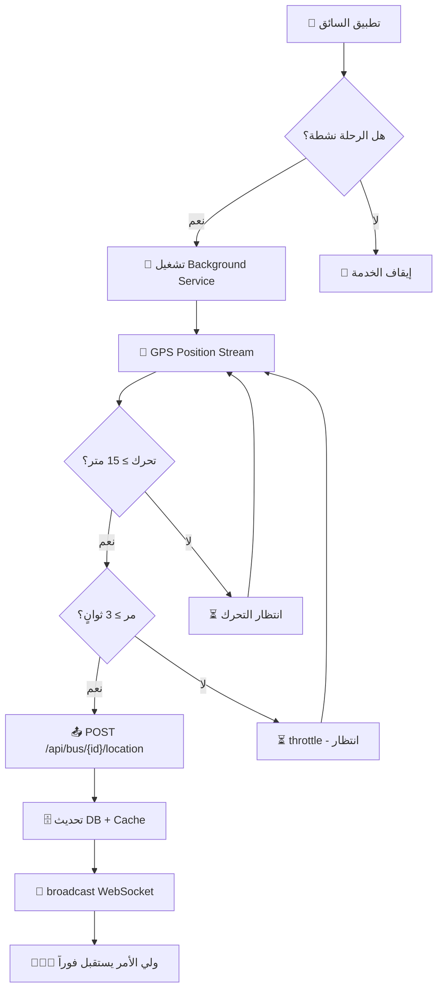

# 📍 تحليل عميق: إرسال الموقع الدوري من السائق واستقباله عند ولي الأمر

---

## 🔑 ملخص سريع للإجابات على أسئلتك

| السؤال | الإجابة |
|--------|---------|
| هل الموقع يُرسل بشكل دوري مستمر؟ | ✅ **نعم** — عبر Background Service + GPS Stream |
| هل ولي الأمر يستقبله بشكل دوري؟ | ✅ **نعم** — عبر WebSocket لحظي + HTTP Polling احتياطي |
| ما وظيفة `timestamp`؟ | ⏱️ الطابع الزمني الذي يُرسله السائق مع كل تحديث |
| ما وظيفة `last_location_update`؟ | 🗄️ حقل في قاعدة البيانات يُسجل آخر وقت وصل فيه موقع |
| لماذا ❌ بجانب `target_lat` و`heading`؟ | ℹ️ يعني **"غير مطلوب"** (اختياري) وليس خطأ! |

---

## 1️⃣ كيف يُرسل تطبيق السائق الموقع بشكل دوري؟

### هناك طبقتان تعملان معاً:

### الطبقة الأولى: Background Service (خدمة خلفية دائمة)
- **الملف**: [location_service.dart](file:///c:/Users/ASUS/StudioProjects/msaratwasel-services/lib/core/services/location_service.dart)
- تعمل كـ **Foreground Service** على Android (تظهر إشعار "تتبع الرحلة نشط")
- **متى تبدأ؟** عندما يبدأ السائق رحلة `in_progress` — [driver_home_cubit.dart:72](file:///c:/Users/ASUS/StudioProjects/msaratwasel-services/lib/features/driver/home/presentation/manager/driver_home_cubit.dart#L72)
- **متى تتوقف؟** عند انتهاء الرحلة — [end_trip_screen.dart:510](file:///c:/Users/ASUS/StudioProjects/msaratwasel-services/lib/features/driver/trip/presentation/screens/end_trip_screen.dart#L510)

#### آلية الإرسال الدوري في الخدمة الخلفية:
```dart
// location_service.dart — سطر 123-157
Geolocator.getPositionStream(
  locationSettings: const LocationSettings(
    accuracy: LocationAccuracy.high,
    distanceFilter: 15, // ← يُفعّل فقط عند تحرك 15 متر
  ),
).listen((Position position) async {
  // Throttle: لا يرسل أكثر من مرة كل 3 ثوانٍ
  if (lastEmitTime != null && now.difference(lastEmitTime!).inSeconds < 3) {
    return;
  }
  lastEmitTime = now;

  await repository.updateLocation(
    latitude: position.latitude,
    longitude: position.longitude,
    heading: position.heading,
    speed: position.speed,
    accuracy: position.accuracy,
  );
});
```

> [!IMPORTANT]
> **الخدمة الخلفية** تضمن استمرار إرسال الموقع حتى لو أغلق السائق التطبيق أو قفل الشاشة. تعمل على Android كـ Foreground Service مع إشعار دائم.

---

### الطبقة الثانية: شاشة الملاحة (Foreground — أثناء استخدام التطبيق)
- **الملف**: [route_navigation_screen.dart](file:///c:/Users/ASUS/StudioProjects/msaratwasel-services/lib/features/driver/route/presentation/screens/route_navigation_screen.dart#L835-L913)

```dart
// route_navigation_screen.dart — سطر 835-893
_gpsSubscription = Geolocator.getPositionStream(
  locationSettings: const LocationSettings(
    accuracy: LocationAccuracy.high,
    distanceFilter: 20, // ← تحديث كل 20 متر
  ),
).listen((Position position) {
  // Throttle: كل 6 ثوانٍ كحد أقصى
  if (_lastUpdateLocationTime == null || 
      now.difference(_lastUpdateLocationTime!).inSeconds >= 6) {
    _lastUpdateLocationTime = now;
    _routeRepository.updateLocation(
      latitude: position.latitude,
      longitude: position.longitude,
      heading: position.heading,
      targetLat: _currentTarget?.latitude,  // ← إحداثيات الطالب التالي
      targetLng: _currentTarget?.longitude,
    );
  }
});
```

### ملخص آلية الإرسال الدوري:



---

## 2️⃣ كيف يستقبل ولي الأمر الموقع بشكل دوري؟

### المستوى الأول: WebSocket لحظي (Primary — الأساسي) ⚡

تطبيق ولي الأمر يتصل بـ Laravel Reverb عبر WebSocket ويشترك في قناة الباص:

```dart
// app_controller.dart — سطر 536-541
for (var student in _students) {
  if (student.bus.id.isNotEmpty && student.bus.id != '-') {
    final channel = 'private-bus.${student.bus.id}';
    _reverbService?.subscribe(channel);  // ← الاشتراك في قناة الباص
  }
}
```

**عند كل تحديث موقع من السائق:**
1. السيرفر يبث حدث `driver.location.updated` على القناة `private-bus.{id}`
2. تطبيق ولي الأمر يستقبله فوراً في [reverb_service.dart:133-145](file:///c:/Users/ASUS/StudioProjects/msaratwasel_parent/lib/src/core/services/reverb_service.dart#L133-L145)
3. يُمرّر إلى `_handleRealtimeLocationUpdate` في [app_controller.dart:1014-1025](file:///c:/Users/ASUS/StudioProjects/msaratwasel_parent/lib/src/app/state/app_controller.dart#L1014-L1025)
4. تُحدّث الخريطة والبيانات فوراً عبر `_updateBusTracking` → `notifyListeners()`

> [!TIP]
> **WebSocket = لحظي!** ولي الأمر يرى الباص يتحرك على الخريطة في نفس لحظة تحرك السائق (تأخير أقل من ثانية واحدة).

---

### المستوى الثاني: HTTP Polling (Fallback — احتياطي) 🔄

إذا انقطع اتصال WebSocket، يعمل نظام polling احتياطي:

```dart
// app_controller.dart — سطر 590-601
void _scheduleTrackingPoll({bool immediate = false}) {
  // إذا كانت هناك رحلة نشطة: كل 10 ثوانٍ
  // إذا لا توجد رحلة نشطة: كل 30 ثانية
  final interval = immediate 
      ? 0 
      : (activeTripGroups.isNotEmpty ? 10 : 30);
      
  _trackingTimer = Timer(
    Duration(seconds: interval),
    _runTrackingPollCycle,
  );
}
```

**الذكاء في النظام:** إذا كان WebSocket نشط ومتصل، يتوقف الـ Polling تلقائياً لتوفير البطارية والبيانات:

```dart
// app_controller.dart — سطر 624-651
if (isReverbActive) {
  AppLogger.d('ℹ️ WebSocket is active. Skipping HTTP Polling.');
  // كل 60 ثانية فقط يعمل refresh كامل كتأمين إضافي
  if (_pollCycleCount % 6 == 0) {
    await _refreshStudentStatuses();
  }
  return;
}
// إذا WebSocket مش شغال → يعمل HTTP polling كل 10 ثوانٍ
await _fetchTrackingFromApi();
```

---

## 3️⃣ توضيح الحقول المسؤولة

### `timestamp` (في الطلب من السائق)
- **ملف**: [route_repository_impl.dart:288-306](file:///c:/Users/ASUS/StudioProjects/msaratwasel-services/lib/features/driver/route/data/repositories/route_repository_impl.dart#L288-L306)
- **وظيفته**: الطابع الزمني الذي يُرسله تطبيق السائق مع كل طلب تحديث موقع
- **مثال**: `"2026-05-30T01:30:00.000Z"`
- **الغرض**: يُستخدم في السيرفر لمعرفة متى بالضبط التقط السائق هذا الموقع
- يُبث لولي الأمر في بيانات الـ WebSocket حتى يعرف "آخر تحديث"

```dart
// route_repository_impl.dart — ما يرسله السائق
data: {
  'bus_id': _cachedBusId,
  'latitude': latitude,
  'longitude': longitude,
  'heading': heading ?? 0.0,
  'timestamp': timestamp,                          // ← هذا هو
  'sequence_number': DateTime.now().millisecondsSinceEpoch,
}
```

### `last_location_update` (في قاعدة البيانات)
- **ملف**: [BusLocationController.php:47](file:///c:/laragon/www/masarat-wasel-dashboards/app/Http/Controllers/Api/BusLocationController.php#L47)
- **جدول**: `buses`
- **وظيفته**: يُسجل آخر مرة وصل فيها تحديث موقع من السائق إلى السيرفر
- **ليس مسؤولاً عن الإرسال الدوري** — هو فقط **يُسجّل** متى وصل آخر تحديث
- **يُستخدم لـ**:
  1. حساب السرعة (المسافة ÷ الزمن بين آخر تحديثين)
  2. معرفة هل السائق "متصل" أم لا (إذا مر أكثر من 10 دقائق = غير نشط)
  3. يُرسل لولي الأمر كـ `last_update` في الـ response

```php
// BusLocationController.php — سطر 44-48
$updateData = [
    'latitude' => $request->latitude,
    'longitude' => $request->longitude,
    'last_location_update' => now(),  // ← يُسجل الوقت الحالي
];
```

### `target_lat` / `target_lng` / `heading` — لماذا ❌؟
- علامة **❌** في التقرير السابق تعني **"غير مطلوب" (Optional)** وليس "لا يعمل" أو "خطأ"
- هذه الحقول **اختيارية** — السائق يرسلها فقط عندما تكون متوفرة:

| الحقل | الوظيفة | متى يُرسل؟ |
|-------|---------|------------|
| `heading` | اتجاه حركة السائق (بالدرجات 0-360) | دائماً — من GPS |
| `target_lat` | خط عرض الطالب التالي (الوجهة) | فقط أثناء الملاحة النشطة |
| `target_lng` | خط طول الطالب التالي (الوجهة) | فقط أثناء الملاحة النشطة |

> [!NOTE]
> `target_lat/lng` تُستخدم لرسم خط من الباص إلى الطالب التالي على خريطة ولي الأمر. تُرسل فقط عندما يكون السائق في شاشة الملاحة.

---

## 4️⃣ الجدول الزمني الكامل: ماذا يحدث كل ثانية

```
الثانية 0:   السائق يتحرك → GPS يلتقط موقع جديد
الثانية 0:   distanceFilter يتحقق: تحرك ≥ 15 متر؟
الثانية 0:   Throttle يتحقق: مر ≥ 3 ثوانٍ من آخر إرسال؟
الثانية 0:   ✅ POST /api/bus/{id}/location → السيرفر يستلم
الثانية 0.1: السيرفر يُحدث buses.latitude, longitude, last_location_update
الثانية 0.1: السيرفر يحسب السرعة ويخزنها في Cache
الثانية 0.2: السيرفر يبث BusLocationUpdated + DriverLocationUpdated عبر Reverb
الثانية 0.3: WebSocket يوصل الحدث لتطبيق ولي الأمر
الثانية 0.3: تطبيق ولي الأمر يُحدث الخريطة ← 🗺️ الباص يتحرك!
الثانية 0.4: السيرفر يتحقق: هل الباص قرب منزل طالب (≤ 2 كم)؟
الثانية 0.5: إذا نعم → إرسال Push Notification لولي الأمر 🔔
```

---

## 5️⃣ الملفات الأساسية المسؤولة

### تطبيق السائق (Flutter)
| الملف | الدور |
|-------|-------|
| [location_service.dart](file:///c:/Users/ASUS/StudioProjects/msaratwasel-services/lib/core/services/location_service.dart) | **الخدمة الخلفية** — تُرسل الموقع حتى لو التطبيق مغلق |
| [route_navigation_screen.dart](file:///c:/Users/ASUS/StudioProjects/msaratwasel-services/lib/features/driver/route/presentation/screens/route_navigation_screen.dart#L835-L913) | **شاشة الملاحة** — تُرسل الموقع + target أثناء القيادة |
| [route_repository_impl.dart](file:///c:/Users/ASUS/StudioProjects/msaratwasel-services/lib/features/driver/route/data/repositories/route_repository_impl.dart#L271-L318) | **الطبقة الشبكية** — تبني الـ request وترسله للـ API |
| [driver_home_cubit.dart](file:///c:/Users/ASUS/StudioProjects/msaratwasel-services/lib/features/driver/home/presentation/manager/driver_home_cubit.dart#L70-L76) | **التحكم بالتشغيل/الإيقاف** — start عند بدء الرحلة، stop عند الانتهاء |

### السيرفر (Laravel)
| الملف | الدور |
|-------|-------|
| [BusLocationController.php](file:///c:/laragon/www/masarat-wasel-dashboards/app/Http/Controllers/Api/BusLocationController.php#L31-L213) | **يستقبل** الموقع، يحسب السرعة، يبث عبر WebSocket |
| [DriverLocationUpdated.php](file:///c:/laragon/www/masarat-wasel-dashboards/app/Events/DriverLocationUpdated.php) | **حدث البث** — يُرسل عبر Reverb لجميع المشتركين |
| [channels.php](file:///c:/laragon/www/masarat-wasel-dashboards/routes/channels.php#L26-L93) | **صلاحيات القنوات** — يتحقق أن ولي الأمر له حق المتابعة |

### تطبيق ولي الأمر (Flutter)
| الملف | الدور |
|-------|-------|
| [reverb_service.dart](file:///c:/Users/ASUS/StudioProjects/msaratwasel_parent/lib/src/core/services/reverb_service.dart#L133-L145) | **يستقبل** أحداث الموقع عبر WebSocket |
| [app_controller.dart](file:///c:/Users/ASUS/StudioProjects/msaratwasel_parent/lib/src/app/state/app_controller.dart#L1014-L1025) | **يعالج** التحديث ويُحدث الخريطة |
| [app_controller.dart (polling)](file:///c:/Users/ASUS/StudioProjects/msaratwasel_parent/lib/src/app/state/app_controller.dart#L584-L678) | **Polling احتياطي** — يعمل إذا انقطع WebSocket |

---

## 6️⃣ معدلات الإرسال والاستقبال

### معدل الإرسال (السائق → السيرفر)

| الطبقة | المعدل | الشرط |
|--------|--------|-------|
| Background Service | كل **3 ثوانٍ** كحد أقصى | عند تحرك ≥ 15 متر |
| شاشة الملاحة | كل **6 ثوانٍ** كحد أقصى | عند تحرك ≥ 20 متر |

### معدل الاستقبال (ولي الأمر)

| الطريقة | المعدل | الشرط |
|---------|--------|-------|
| WebSocket (أساسي) | **فوري** (< 1 ثانية) | عند كل تحديث من السائق |
| HTTP Polling (احتياطي) | كل **10 ثوانٍ** | فقط إذا WebSocket غير متصل |
| Refresh كامل | كل **60 ثانية** | تأمين إضافي لتحديث الحالات |
